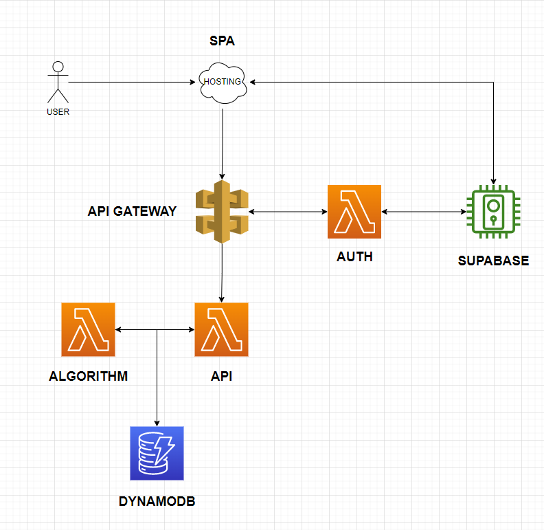

- [Introduction](#introduction)
- [Structure](#structure)
  - [Modules](#modules)
  - [Environments](#environments)
- [Instructions](#instructions)
- [Hints](#hints)
- [CI/CD](#cicd)

# Introduction
Repository to host infrastructure for hospitalplanner. This project is done in terraform over AWS. Terraform backend is located manually in an S3 bucket explicitly created to do so.

The architecural pattern followed in this application is **Serverless**, and is depicted is the following diagram:



# Structure

## Modules
Different reusable terraform modules of the project. They define the architecture itself.

    - apigateway
    - buckets
    - database
    - lambdas
## Environments
Environment directories where terraform is initialized.

    - dev:
    - prod

# Instructions

1. Install terraform from https://www.terraform.io/.

2. Configure **your** user credentials to allow terraform to connect to S3 backend:

```bash
export AWS_ACCESS_KEY_ID="XXXXX"
export AWS_SECRET_ACCESS_KEY="XXXXX"
export AWS_SESSION_TOKEN="XXXXX"
```

3. Initialize the terraform proyect to connect to backend and start terraform in the directory needed. If you are not sure which directory you want, use **dev**.
```bash
$ cd environments/dev
(..)/environments/dev$ terraform init
```


4. Set up credentials file with the **terraform** user credentials and the supabase anon key. In the root of the repo (or anywhere you want), create a credentials.env with the following structure:

``` 
# Terraform user credentials
export TF_VAR_AWS_ACCESS_KEY=XXXX
export TF_VAR_AWS_SECRET_KEY=YYYYYYYYY

# Supabase anon key
export TF_VAR_SUPABASE_ANON_KEY=ZZZZZZZZZZZZZ
```
⚠️ **WARNING >>>>> MAKE SURE YOU INCLUDE THE FILE IN .gitignore !!!!**


5. Source the credentials file.

```bash
source credentials.env
```

# Hints
You can run 
```bash
terraform plan
```
 
to debug and see the effect of your plan in the cloud, with respect to previous state. For example, for dev, go to the dev directory and run

```bash
hospitalplanner-inf/environments/dev$ terraform plan
```

**WARNING:** Watch out to apply changes because they do deploy the defined infrastructure on the cloud.

# CI/CD
You can refer to `.github/workflows/terraform.yml`  to check the CICD. The standard adopted for git branches is the following:
1. Deployments to `dev` branch will trigger CI actions to verify the pull request or push is correct. It will use terraform plan to do so.
2. Deployments to `main` branch will trigger CI **and** CD actions, deploying both **dev** and **prod** environments into AWS.